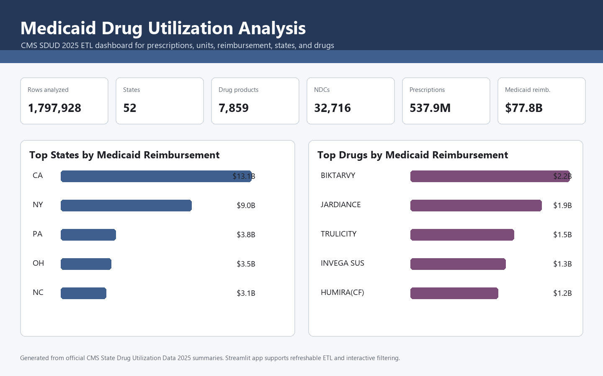

Medicaid Drug Utilization Analysis
==================================

This is a Streamlit analytics app and automated Python ETL pipeline for CMS Medicaid State Drug Utilization Data (SDUD). It uses the latest configured CMS file, preprocesses millions of utilization and reimbursement rows, builds normalized analysis outputs, and lets users explore Medicaid drug utilization interactively.



[](https://share.streamlit.io/deploy?repository=https://github.com/omkar-dharkar/Medicaid-Drug-Utilization-Analysis&branch=main&mainModule=app.py)

Official source page:

```text
https://www.medicaid.gov/medicaid/prescription-drugs/state-drug-utilization-data
```

Current data file:

```text
https://download.medicaid.gov/data/StateDrugUtilizationData-2025.csv
```

Run The App
-----------

From this folder:

```powershell
streamlit run app.py
```

Or double-click:

```text
run_project.bat
```

The app opens in your browser. If `outputs/` has not been generated yet, use the sidebar button to run the latest CMS ETL.

Deploy On Streamlit Community Cloud
-----------------------------------

1. Go to the deploy link above.
2. Sign in with GitHub.
3. Select repository `omkar-dharkar/Medicaid-Drug-Utilization-Analysis`.
4. Set branch to `main`.
5. Set main file path to `app.py`.
6. Click `Deploy`.

The GitHub version includes lightweight 2025 summary outputs so the hosted app can open immediately. The full processed CMS CSV is intentionally not committed because it is large; use the app sidebar or `python medicaid_analysis.py` to regenerate full local ETL outputs.

Refresh Latest CMS Data
-----------------------

Inside the Streamlit sidebar, click `Run Latest CMS ETL`.

You can also refresh from the terminal:

```powershell
python medicaid_analysis.py
```

The default ETL uses:

- CMS SDUD 2025
- all available 2025 quarters
- suppressed rows excluded
- national total rows where state is `XX` excluded

Last Successful ETL Run
-----------------------

```text
Source: https://www.medicaid.gov/medicaid/prescription-drugs/state-drug-utilization-data
Data file: https://download.medicaid.gov/data/StateDrugUtilizationData-2025.csv
Period: 2025, all available quarters
Rows read: 3,972,559
Rows analyzed: 1,797,928
States: 52
Drug products: 7,859
NDCs: 32,716
Total prescriptions: 537,883,021
Total Medicaid reimbursement: $77,753,123,920
```

What The App Shows
------------------

- KPI summary for rows, states, prescriptions, units, and reimbursement
- state-level Medicaid and non-Medicaid reimbursement
- top drugs by Medicaid reimbursement
- top drugs by prescription count
- top drugs by units reimbursed
- quarterly reimbursement trends
- utilization type comparison
- labeler/manufacturer concentration
- downloadable filtered CSV outputs
- ETL metadata and generated file inventory

ETL Outputs
-----------

Running the pipeline creates:

```text
outputs/run_metadata.json
outputs/medicaid_report.html
outputs/processed/clean_sdud_2025_all_quarters.csv
outputs/normalized_tables/*.csv
outputs/summary_tables/*.csv
```

The Streamlit app uses `outputs/processed/clean_sdud_2025_all_quarters.csv` for interactive filtering and `outputs/run_metadata.json` for source/run status. Generated `outputs/` files are intentionally not committed to GitHub because the processed CMS file is large.

Install Dependencies
--------------------

This machine already has the required packages through Anaconda. On another machine:

```powershell
pip install -r requirements.txt
```

Project Files
-------------

- `app.py`: Streamlit dashboard
- `medicaid_analysis.py`: automated CMS ETL, preprocessing, summary generation, and static report generation
- `requirements.txt`: Python dependencies
- `run_project.bat`: launches the Streamlit app
- `run_etl.bat`: refreshes the CMS ETL from the terminal
- `outputs/`: generated app/report data

Data Notes
----------

- `Non Medicaid Amount Reimbursed` is broader than private insurance only. It can include private insurance, copays, or other federal coverage.
- The app uses the official CMS CSV download rather than row-by-row API pagination because SDUD has millions of rows and the CSV path is faster and more reliable for full-file analytics.
- The source URL shown in the app and terminal output is the CMS Medicaid SDUD page, with the exact data file shown separately.

Skills Demonstrated
-------------------

- Streamlit dashboard development
- automated Python ETL with pandas
- large CSV chunk processing
- CMS Medicaid utilization and reimbursement preprocessing
- normalized table modeling
- interactive Plotly visual analytics
- source-aware, refreshable analytics workflow
